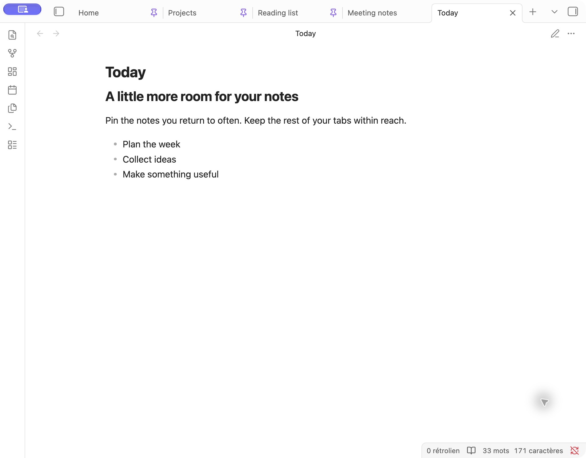
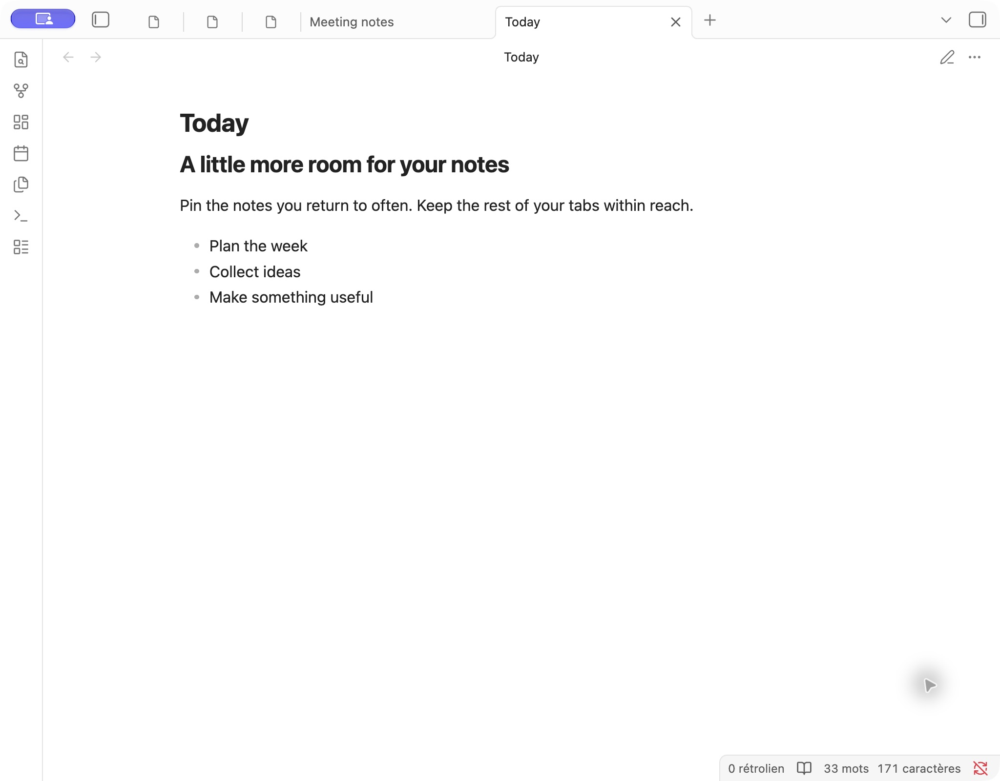

# Shrink pinned tabs for Obsidian

Keep your pinned notes within reach while leaving more room for other tabs.

## Preview

**Before** — regular Obsidian tabs:

**After** — compact pinned tabs, with titles and pin buttons hidden:

## Install

In Obsidian, open **Settings → Community plugins → Browse**, search for **Shrink pinned tabs**, then install and enable it.

Right-click a tab and choose **Pin** to make it compact.

## Settings

| Setting | What it does |
| --- | --- |
| Compact pinned tabs | Turn compact tabs on or off. |
| Tab title | Show titles always, only on active tabs, or never. |
| Pin icon | Keep the pin clickable, make it non-clickable, or hide it. Use the tab menu to unpin when needed. |
| Maximum tab width | Choose 20–160 px in steps of 10. Default: 60 px, with a reset button. |

Changes apply immediately. The width is a maximum: available space and your theme can make tabs narrower.

The command palette also offers **Toggle compact pinned tabs** and **Toggle tab title display**. Settings are searchable on Obsidian 1.13 and newer.

## Compatibility

Requires **Obsidian 1.1.9 or newer**. Works with regular desktop tabs, including detached windows. Mobile, stacked tabs and sidebar tabs retain their native appearance. Themes that override tab styling may affect the result.

## Contributing

Found a problem or have an idea? [Open an issue](https://github.com/nicosomb/obsidian-shrink-pinned-tabs/issues). For builds, testing and releases, see [CONTRIBUTING.md](CONTRIBUTING.md).

Inspired by [woofy31’s CSS snippet](https://forum.obsidian.md/t/shrink-the-size-of-pinned-tabs/71914/2).
