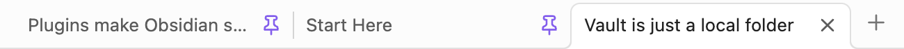
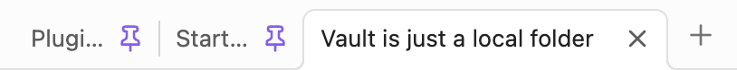
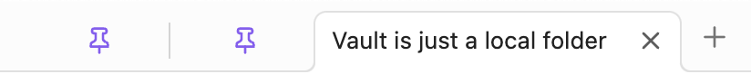

# Shrink pinned tabs plugin for Obsidian

This plugin enables you to shrink pinned tabs in Obsidian UI. You can also show or hide the tab title in the plugin settings. 

This plugin is inspired by [a snippet from woofy31 on Obsidian's forum](https://forum.obsidian.md/t/shrink-the-size-of-pinned-tabs/71914/2).

## How does it look? 

### Default display in Obsidian



### Shrinked tabs 



### Shrinked tabs with no title



## Settings

- **Compact pinned tabs** enables compact tabs, including in detached windows. The command **Toggle compact pinned tabs** also toggles this setting.
- **Tab title** shows titles always, only on active tabs, or never. The existing **Toggle tab title display** command switches between always and never. Previous preferences are migrated automatically.
- **Pin icon** keeps the pin clickable, makes it non-clickable, or hides it. Use the tab context menu to unpin when the icon is non-clickable or hidden.
- **Maximum tab width** caps the width of pinned tabs between 20 and 160 pixels (default: 60). Available space and your theme can make tabs narrower.

On Obsidian 1.13 and newer, all settings are available in settings search. Older versions use the same controls in the plugin settings tab.

Changes take effect immediately and are saved for the next session. If saving fails, a notice asks you to retry.

## Development

Use Node.js 24 LTS (`nvm use` if you use nvm).

```sh
npm ci
npm run check
```

`check` runs lint (including the official Obsidian rules), tests, the build, and version checks. Lint warnings fail the check. Unit tests use a stub of the Obsidian API and DOM mutation observers. Run browser checks with `npx playwright install chromium` followed by `npm run test:browser`. CI runs both suites. CSS is checked with the official Obsidian Stylelint rules.

Compact styling applies to regular desktop tabs. Mobile, stacked tabs and sidebar tabs retain their native appearance. Themes that force their own styles may affect the result.

Use `npm run dev` for watch mode. To test manually, copy `main.js`, `manifest.json`, and `styles.css` into `.obsidian/plugins/shrink-pinned-tabs/` in a test vault, then reload the plugin.

### Before a release

- Check pin/unpin, changing settings, and the title command.
- Restart Obsidian and confirm settings still apply.
- Disable the plugin and confirm the original tab appearance returns.
- Verify that unpinned tabs are unchanged (regression #3).
- Check the default theme and a community theme, stacked tabs, detached windows, and mobile.

Manual checks in Obsidian, including detached windows and the minimum supported version (1.1.9), remain part of release validation.

Use `npm version patch` to update package, manifest, and compatibility metadata together. Pushing the resulting version tag runs the checks and creates a **draft** GitHub release with the three plugin files; publish it after manual verification.

Release assets are attested by GitHub Actions before the draft release is created. After downloading an asset, its provenance can be checked with:

```sh
gh attestation verify main.js --repo nicosomb/obsidian-shrink-pinned-tabs
gh attestation verify styles.css --repo nicosomb/obsidian-shrink-pinned-tabs
```

The Obsidian ESLint package currently declares older Obsidian and `@eslint/js` dependencies. The overrides in `package.json` keep it on the versions used by this project.
